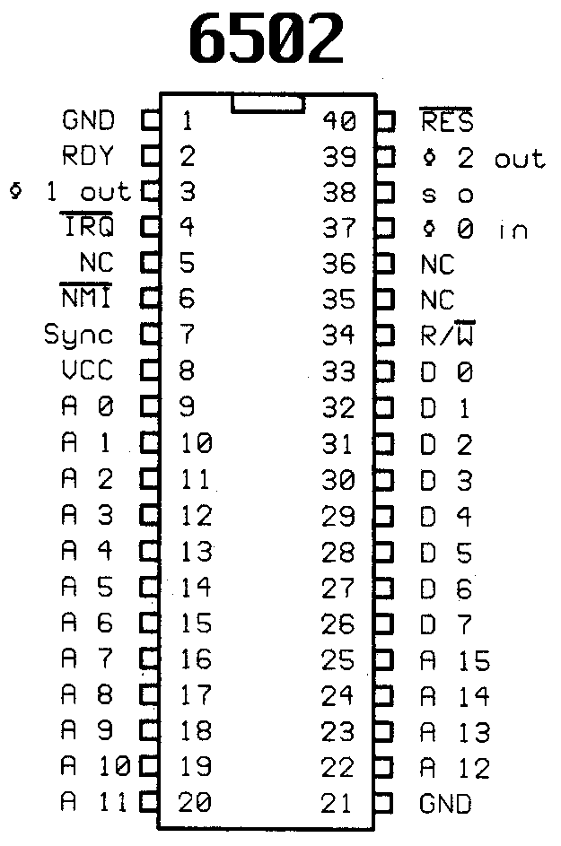

# 6502

The target platform for this project is the Atari 2600. The Atari 2600 has the
following specs:

- CPU: 1.19 MHz (6507 processor) - 1.19 million instructions per second
- Audio/Video: TIA Chip (Television Interface Adapter)
- RAM: 128 Bytes 6532 RIOT Chip
- ROM (Game Cartridge): 4kb
- Input: Two controller ports (joystick, paddle, etc)
- Output: TV via RCA Connector (NTSC, PAL, SECAM)

## 6502 Processor

The 6502 powered many successful machines from the 70's and 80s:

- Apple IIe
- BBC Micro
- Commodore PET
- Commodore VIC-20
- Commodore 64
- Tamagotchi
- Atari 2600
- NES

### 6502 Pinout

[Visual 6502](http://visual6502.org/JSSim/index.html) may be helpful in
visualizing how the CPU works. Additionally,
[this](https://retrocomputing.stackexchange.com/questions/11216/how-exactly-do-all-control-signals-in-6502-work)
Stackoverflow answer provides more details on how the control signals in the
6502 work.

- Pin #1 (GND) is the "ground" - reference point from which voltages are
  measured - 0V
- Pin #2 (RDY) is the "ready" pin. RDY is stimulated whenever we want to trigger
  an event (i.e. the TV set is "ready")
- Pin #3 (ø1 out) Phi1 out - System clock output
  [additional info](https://lateblt.livejournal.com/88105.html)
- Pin #4 (IRQ) is for an Interupt ReQuest (maskable interrupt). When going LOW,
  the CPU loads the PC with the value stored in \$fffe/\$ffff after processing
  the current command. This procedure will be executed only when interrupts have
  been enabled (bit 2 in flag register = 0).
- Pin #5 (NC) Not Connected
- Pin #6 (NMI) is for a Non Maskable Interrupt - When going LOW, the CPU loads
  the PC with the value stored in \$fffa/\$fffb after processing the current
  command
- Pin #7 (Sync) Synchronization - becomes HIGH whenever CPU fetches an opcode.
  Together with pin 2 (RDY), you can build a single step mode hardwarewise.
- Pin #8 (VCC) supply voltage. Pin is connected to +5V DC.
- Pins #9-20 (A0-A11) are for the address bus (move values to/from processor
  registers) - first 12 bits. The CPU applies the address of the next datum to
  be read or written.
- Pin #21 (GND) ground - 0V
- Pins #22-25 (A12-A15) address bus - last 4 bits
- Pins #26 - 33 (D7-D0) 8 bits for the data bus (move values to/from processor
  registers)
- Pin #34 (R/-W) Read/-Write. With this line, the CPU controls whether the next
  DRAM access will be a read or write cycle. LOW=write, HIGH=read.
- Pin #35 (NC) Not Connected
- Pin #36 (NC) Not Connected
- Pin #37 (ø 0 in) Phi 0 in - The system clock signal is applied to this input.
  In the VIC-20 and the 1541 floppy drive, it is about 1 MHz.
- Pin #38 (/s o) Set Overflow - Pulling this pin to LOW sets the overflow flag
  in the status register.
- Pin #39 (ø2 out) Phi2 out - The CPU outputs the system clock for the rest of
  the chips for sychronization.
- Pin #40 (/RES) RESet - When going LOW, the CPU resets and waits for a LOW-HIGH
  transition to load the PC with the value stored in \$fffc/\$fffd.

[Source](https://ist.uwaterloo.ca/~schepers/MJK/6502.html)

#### Buses

A bus is a collection of wires through which data is transmitted. The speed of a
bus is measured in megahertz (MHz) and is based off the clock that is used to
regulate the transfers. The size of a bus (its width) is how many bits it can
transfer at a time. Buses can be unidirectional or bidirectional. There are two
buses in the 6502:

##### Data Bus

The data bus is controlled by pins #26-#33 (D7 - D0) which provide 8 bits for
storing and moving data from inside and outside the registers of the processor.
These hold the actual value that we want to set or retrieve from the processor
registers.

##### Address Bus

The address bus is controlled by pins #9-20 (A0-A11) and pins #22025 (A12 - A15)
which store memory addresses. If the data bus stores the actual value, the
address bus stores the address of where things are.

#### Interrupts
